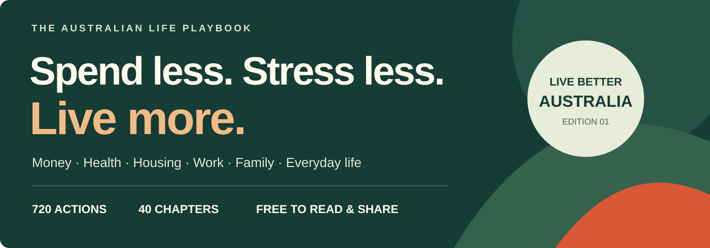

# Live Better Australia 🇦🇺

### Spend less. Stress less. Live more.

**Know your rights. Cut everyday costs. Find your next step in Australian life.**

Life admin gets expensive when you have to learn every system the hard way. This free, open guide brings useful next steps together — in Australian English, for people living ordinary lives across Australia.

**[Read online](https://gerrygao1995-coder.github.io/live-better-australia/) · [Start here](https://gerrygao1995-coder.github.io/live-better-australia/start-here.html) · [Find your situation](SCENARIOS.md) · [Browse all 40 chapters](#the-full-playbook) · [Download the project](https://github.com/gerrygao1995-coder/live-better-australia/archive/refs/heads/main.zip)**

Edition 1.1 · Reviewed **9 October 2026** · Content **CC BY 4.0** · Reader and build code **MIT**

## Start with something you can use today

**[20 useful things to know in Australia](https://gerrygao1995-coder.github.io/live-better-australia/20-useful-things.html)** — a selected introduction to Medicare, super, bills, consumer rights and more, with sources and scope notes.

| What is happening? | A short, shareable checklist |
| --- | --- |
| Work has changed | [Lost your job in Australia? Start here](https://gerrygao1995-coder.github.io/live-better-australia/lost-your-job.html) |
| You are moving out | [Renting your first place? Read this before you sign](https://gerrygao1995-coder.github.io/live-better-australia/first-rental.html) |
| Your family is growing | [Before your baby arrives: the Australian admin checklist](https://gerrygao1995-coder.github.io/live-better-australia/before-baby-arrives.html) |

Each checklist has official links, browser-local ticks, a shareable URL and a print / save-PDF layout. Then explore the complete **720-action, 40-chapter** guide at your own pace.

## What makes this useful

- **A next action, not just a link.** Every entry explains what to do, the likely effort, who it applies to and its potential value.
- **Australian systems in plain English.** Medicare, tenancy, super, work rights, TAFE, family support, rural access and more, with local limitations made explicit.
- **Evidence you can inspect.** Official rules, official or professional guidance, and practical editorial suggestions have different labels. Practical tips are not presented as proven outcomes.
- **Use it your way.** Read by chapter, choose one of 16 life situations, or search the standalone reader and save a personal action shortlist.
- **Built to share and improve.** Stable action IDs, direct chapter links, a source directory, an upstream mapping and a clear contribution process. No affiliate links or sponsored placements.

## Where should I start?

| If this sounds like you… | Start with |
| --- | --- |
| Bills are piling up | [Everyday costs](book/05-everyday-costs.md) · [Banking and debt](book/07-banking-and-debt.md) · [Help when money is tight and disability support](book/09-money-help-and-disability-support.md) |
| I have just lost my job | [Work rights](book/10-work-rights.md) · [Help when money is tight and disability support](book/09-money-help-and-disability-support.md) · [Education and career](book/11-education-and-career.md) |
| I am renting, buying or moving | [Renting and buying a home](book/06-renting-and-buying-a-home.md) · [Moving home or city](book/36-moving-home.md) · [Climate, disasters and resilient homes](book/26-climate-disasters-and-resilient-homes.md) |
| I need healthcare without a maze | [Healthcare and medicines](book/03-healthcare-and-medicines.md) · [Chronic conditions](book/19-chronic-conditions.md) · [Mental health and energy](book/04-mental-health-and-energy.md) |
| We are having a baby | [Pregnancy and birth](book/20-pregnancy-and-birth.md) · [Babies and early childhood](book/21-babies-and-early-childhood.md) · [Relationships and children](book/12-relationships-and-children.md) |
| My child is getting older | [School age and teenagers](book/22-school-age-and-teenagers.md) · [Relationships and children](book/12-relationships-and-children.md) · [AI, privacy and digital judgement](book/35-ai-privacy.md) |
| A relationship has become unsafe or ended | [Emergencies](book/01-emergencies.md) · [Separation and family law](book/30-separation-and-family-law.md) · [Consumer and legal rights](book/14-consumer-and-legal-rights.md) |
| A parent needs more help | [Ageing and bereavement](book/13-ageing-and-bereavement.md) · [Disability health and access](book/23-disability-health-and-access.md) · [Retirement transitions](book/28-retirement-transitions.md) |

[See all 16 situations →](SCENARIOS.md)

## Read it offline

1. Download this repository using **Code → Download ZIP**, then extract it.
2. Open **index.html** in a modern browser. No install, account or internet connection is needed for the reader itself. Source links need internet access.
3. Search, filter by chapter or evidence basis, and select **Save action** to build a shortlist. Saved action IDs stay in that browser; browser storage settings may prevent persistence.
4. Choose **My saved actions → Print matching actions** to print or save a PDF of your shortlist.

The HTML file is self-contained and can also be shared on its own. Keep the complete folder for the Start here page, checklists, selected 20, supporting web pages and Markdown chapters offline.

## The full playbook

**Stay safe and well:** [Emergencies](book/01-emergencies.md) · [Everyday health](book/02-everyday-health.md) · [Healthcare and medicines](book/03-healthcare-and-medicines.md) · [Mental health and energy](book/04-mental-health-and-energy.md) · [Chronic conditions](book/19-chronic-conditions.md) · [Pregnancy and birth](book/20-pregnancy-and-birth.md) · [Babies and early childhood](book/21-babies-and-early-childhood.md) · [School age and teenagers](book/22-school-age-and-teenagers.md) · [Disability health and access](book/23-disability-health-and-access.md) · [Appearance, dental and treatment choices](book/24-appearance-dental-and-treatment-choices.md)

**Make money go further:** [Everyday costs](book/05-everyday-costs.md) · [Renting and buying a home](book/06-renting-and-buying-a-home.md) · [Banking and debt](book/07-banking-and-debt.md) · [Super, tax and insurance](book/08-super-tax-and-insurance.md) · [Help when money is tight and disability support](book/09-money-help-and-disability-support.md) · [Transport and car ownership](book/25-transport-and-car-ownership.md) · [Climate, disasters and resilient homes](book/26-climate-disasters-and-resilient-homes.md) · [Food and household value](book/27-food-and-household-value.md) · [Retirement transitions](book/28-retirement-transitions.md) · [Regional and remote living](book/29-regional-and-remote-living.md)

**Know your rights and next steps:** [Work rights](book/10-work-rights.md) · [Education and career](book/11-education-and-career.md) · [Relationships and children](book/12-relationships-and-children.md) · [Ageing and bereavement](book/13-ageing-and-bereavement.md) · [Consumer and legal rights](book/14-consumer-and-legal-rights.md) · [Separation and family law](book/30-separation-and-family-law.md) · [Everyday legal risks and police contact](book/31-everyday-legal-risks-and-police-contact.md) · [Gig work, contracting and self-employment rights](book/32-gig-work-contracting-and-self-employment-rights.md) · [Turning 18 and choosing a path](book/33-turning-18-and-choosing-a-path.md) · [Buying wisely and avoiding traps](book/34-buying-wisely-and-avoiding-traps.md)

**Build a life that works:** [Secure accounts and devices](book/15-digital-security.md) · [Starting a small business](book/16-small-business.md) · [Travel and outdoor safety](book/17-travel-outdoors.md) · [Time, attention and life admin](book/18-time-attention.md) · [AI, privacy and digital judgement](book/35-ai-privacy.md) · [Moving home or city](book/36-moving-home.md) · [Working and studying overseas](book/37-overseas-work-study.md) · [Websites, apps and online projects](book/38-online-projects.md) · [Relationships, community and recreation](book/39-relationships-community.md) · [Getting through major life changes](book/40-major-life-changes.md)

| # | Chapter | What you will find |
| --- | --- | --- |
| 01 | [Emergencies](book/01-emergencies.md) | Prepare before a crisis. In immediate danger, call Triple Zero (000) and follow the operator; these brief entries do not replace practical first-aid training. |
| 02 | [Everyday health](book/02-everyday-health.md) | Prioritise affordable routines and prevention matched to your life. These actions support care; they do not prescribe a universal set of tests, products or targets. |
| 03 | [Healthcare and medicines](book/03-healthcare-and-medicines.md) | Understand the service, the bill and the next step. Medicare, PBS and state programmes have different eligibility and cost rules. |
| 04 | [Mental health and energy](book/04-mental-health-and-energy.md) | Professional care, rest, safer work and connection can all matter. Seek support that fits your circumstances, and use emergency services for immediate danger. |
| 05 | [Everyday costs](book/05-everyday-costs.md) | Start with the purchases and bills that repeat. A useful saving fits your household, preserves what you need and takes less effort than it gives back. |
| 06 | [Renting and buying a home](book/06-renting-and-buying-a-home.md) | Housing choices affect cash flow, time and security. Compare the full cost and keep good records. Rental and property law depends on the state or territory and the type of arrangement. |
| 07 | [Banking and debt](book/07-banking-and-debt.md) | Aim for a system you can understand and maintain. Start with cash needed for essentials, understand the commitments already in place, and ask for help early when repayments no longer fit. |
| 08 | [Super, tax and insurance](book/08-super-tax-and-insurance.md) | A few administrative checks can prevent costly oversights. Rules, thresholds and policy terms change, so use the linked official guidance and your own documents before moving money or changing cover. |
| 09 | [Help when money is tight and disability support](book/09-money-help-and-disability-support.md) | Support is part of the system, and asking early can help. Eligibility depends on the programme and your circumstances. Keep applications and evidence organised, and ask for accessible help when needed. |
| 10 | [Work rights](book/10-work-rights.md) | A useful pay rise can start with receiving what you are already owed. Identify your employment system, keep your own records and act promptly when something goes wrong. |
| 11 | [Education and career](book/11-education-and-career.md) | Choose training by the work it enables, the support available and its full cost. A subsidised place or recognition of existing skills can change the calculation considerably. |
| 12 | [Relationships and children](book/12-relationships-and-children.md) | Good household decisions make money, care and responsibilities discussable. Plan around the people involved, and use specialist help when safety or legal rights are at stake. |
| 13 | [Ageing and bereavement](book/13-ageing-and-bereavement.md) | Small preparations can spare a family difficult decisions during illness or grief. Start with assessed needs, documented wishes and clear responsibilities rather than the first product or service offered. |
| 14 | [Consumer and legal rights](book/14-consumer-and-legal-rights.md) | A low price is poor value if you cannot use the product or resolve a problem. Keep evidence, know which rights apply and send complaints to the body that can actually help. |
| 15 | [Secure accounts and devices](book/15-digital-security.md) | Protect the accounts that unlock your money, identity and memories. Start with your main email account. |
| 16 | [Starting a small business](book/16-small-business.md) | Check the demand, obligations and cash before committing to overheads. A side project still needs a clear business model. |
| 17 | [Travel and outdoor safety](book/17-travel-outdoors.md) | A good trip includes a workable way home. Match the plan to the people, conditions and location. |
| 18 | [Time, attention and life admin](book/18-time-attention.md) | These are optional practical routines. Try the ones that remove friction in your circumstances; the suggested benefits are editorial judgements. |
| 19 | [Chronic conditions](book/19-chronic-conditions.md) | Use personalised plans, coordinated care and reviews that focus on everyday function. This chapter does not diagnose conditions or recommend medicine doses. |
| 20 | [Pregnancy and birth](book/20-pregnancy-and-birth.md) | Seek early, individual maternity advice and compare local care options. Decisions, medical needs and available services differ; support should respect the pregnant person's preferences. |
| 21 | [Babies and early childhood](book/21-babies-and-early-childhood.md) | Spend attention on safe sleep, feeding support, development and preventable hazards. Ask your child-health team about individual needs rather than buying every advertised solution. |
| 22 | [School age and teenagers](book/22-school-age-and-teenagers.md) | Build health skills gradually, listen to young people and coordinate support with schools and clinicians. Privacy, consent and services vary with age and circumstances. |
| 23 | [Disability health and access](book/23-disability-health-and-access.md) | Health care should work with the person’s communication, access needs and choices. NDIS funding and health-system responsibilities are distinct, and eligibility must be checked for the actual support. |
| 24 | [Appearance, dental and treatment choices](book/24-appearance-dental-and-treatment-choices.md) | Put comfort, health, informed consent and realistic outcomes ahead of marketing. Compare the full course of treatment, including aftercare and ongoing costs. |
| 25 | [Transport and car ownership](book/25-transport-and-car-ownership.md) | Getting around well means matching transport to your location, budget and abilities. Compare real journeys and full ownership costs, while keeping maintenance and road safety central. |
| 26 | [Climate, disasters and resilient homes](book/26-climate-disasters-and-resilient-homes.md) | Prepare for the hazards that affect your address and the people who live there. Start with reliable warnings and an achievable plan, then evaluate building improvements and insurance with the right local expertise. |
| 27 | [Food and household value](book/27-food-and-household-value.md) | Use what you own well, keep food safe and compare the useful life of household purchases. Lower cost is helpful only when the item remains safe, suitable and manageable for your household. |
| 28 | [Retirement transitions](book/28-retirement-transitions.md) | Retirement involves time, housing, relationships and administration as well as money. Use your own needs and the current rules to plan; there is no single balance or retirement age that fits everyone. |
| 29 | [Regional and remote living](book/29-regional-and-remote-living.md) | Distance changes how services, travel and household logistics work. Build plans around your actual community and available services, and check access before committing money or a long journey. |
| 30 | [Separation and family law](book/30-separation-and-family-law.md) | Separation involves several decisions with different purposes and deadlines. Organise safety, care, daily money and formal advice without relying on a friend's settlement as a rule for yours. |
| 31 | [Everyday legal risks and police contact](book/31-everyday-legal-risks-and-police-contact.md) | Legal questions depend on the jurisdiction and situation. Use calm preparation, accurate records and timely advice; a general internet rule cannot determine every police power, deadline or obligation. |
| 32 | [Gig work, contracting and self-employment rights](book/32-gig-work-contracting-and-self-employment-rights.md) | A contractor's hourly quote is only part of the arrangement. Establish your status, responsibilities, real costs and dispute options before deciding whether the work is worthwhile. |
| 33 | [Turning 18 and choosing a path](book/33-turning-18-and-choosing-a-path.md) | You do not need your whole life settled at eighteen. Get control of essential records, understand which rules actually apply and choose a next step you can review. |
| 34 | [Buying wisely and avoiding traps](book/34-buying-wisely-and-avoiding-traps.md) | Good value depends on the job a purchase must do, its full cost and whether you will use it. These are practical decision checks, not promises that one brand or price point always wins. |
| 35 | [AI, privacy and digital judgement](book/35-ai-privacy.md) | Use digital tools where you can inspect the result. Keep personal judgement, consent and accountability with people. |
| 36 | [Moving home or city](book/36-moving-home.md) | Treat a move as a sequence of decisions about housing, access, cash and connections. Check local rules for the place you are leaving and the place you are going. |
| 37 | [Working and studying overseas](book/37-overseas-work-study.md) | For Australians planning a longer stay abroad, check the destination’s rules and the Australian obligations that may continue. This is a planning framework, not immigration advice. |
| 38 | [Websites, apps and online projects](book/38-online-projects.md) | Build something maintainable, useful and clear about its responsibilities. These checks also help volunteer groups running a small online service. |
| 39 | [Relationships, community and recreation](book/39-relationships-community.md) | A good life includes connection and enjoyment. Choose activities and arrangements that fit your people, access needs and budget. |
| 40 | [Getting through major life changes](book/40-major-life-changes.md) | Use these planning prompts alongside the relevant health, work, legal and support chapters. Urgent danger needs emergency help, not a checklist. |

## How to read the labels

| Label | Meaning |
| --- | --- |
| **Official rule** | A legal, program or administrative requirement described by its responsible authority. Eligibility and jurisdiction still matter. |
| **Official / professional guidance** | Advice from a government agency, regulator, recognised professional body or relevant primary service provider. This is not a rating of scientific certainty. |
| **Practical suggestion** | An editorial planning habit or useful question. It is not claimed to be a research finding or universal best choice. |

Costs and potential value are qualitative editorial estimates. This project does not promise savings, health outcomes or eligibility. For urgent danger call **000**; see [emergencies](book/01-emergencies.md) for other first steps. Individual health, legal, tax and financial decisions need current information and advice suited to your circumstances.

## An expanded Australian adaptation

Inspired by **[高性价比人生指南 / HowToLiveBetter](https://github.com/eternity4719/HowToLiveBetter)** by **eternity4719 and contributors**. This edition independently rewrites and expands its 34 life themes into 40 Australian chapters. It is not a complete line-by-line translation or an official edition.

The [source map](SOURCE-MAP.md) shows where each original theme went. See [attribution and changes](ATTRIBUTION.md), the [editorial policy](EDITORIAL-POLICY.md) and the [source directory](SOURCES.md).

## Make it better

Found a changed rule, a missing local pathway or an unclear entry? Open an issue with its **AU-xxxx** ID and a primary source, or [contribute a correction](CONTRIBUTING.md). Please keep personal case details out of public issues.

If it helped, share the chapter that solves someone’s current problem. [Ready-to-use launch copy and sharing ideas →](SHARE.md)

Content is shared under [Creative Commons Attribution 4.0](LICENSE). Original reader, build code and artwork use [MIT](LICENSE-CODE). Linked material retains its own copyright and licensing.
